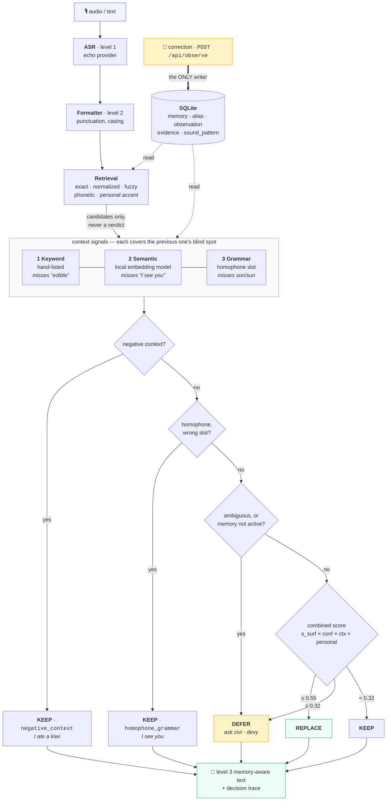

# Kivi · Personal Phonetic Memory

Word-level memory that moves a transcript from **formatted** to **memory-aware** — so Kivi
writes the words *this particular person* uses, the way they use them.

```
ASR          ask aditya to review the sarvam kiwi service
Formatted    Ask Aditya to review the Sarvam Kiwi service.
Memory-aware Ask Aaditya to review the Sarvam Kivi service.
```

`Aditya → Aaditya` is a preferred spelling ASR can't know. `Kiwi → Kivi` is a product name
a model has no reason to prefer. Kivi learns both from ordinary corrections — while leaving
the fruit alone in *"I ate a kiwi today."*

The dictionary is **not** a replacement list. A match only **nominates a candidate**; a
deterministic engine then decides **REPLACE / KEEP / DEFER** and records the scores,
evidence and a plain-English reason for every word.

**Run it:** [`RUN.md`](RUN.md) — `python manage.py {reset|serve|eval|process}`
· Committed results: [`evaluation/results/report.md`](evaluation/results/report.md)

---

## Architecture



Gates are checked **in order** — the first to fire wins. That ordering is the safety story:
a learned accent rule can never override a deliberate KEEP. The score is multiplicative, so
any weak factor vetoes. Processing is **read-only**; only a user correction writes.

## Contextual understanding

**1 · Keyword** — each memory accumulates the words it was confirmed and rejected on. Cheap
and exact; why `open the kiwi service` works on day one. Blind to anything unlisted.

**2 · Semantic** — each utterance becomes a meaning vector, compared against **that
memory's own** confirmed vs rejected examples. Nothing hardcoded per word.

```
Kivi is edible.                    →  unchanged            KEEP    sem −0.63
the kiwi looked crimson and juicy  →  unchanged            KEEP    sem −0.30
Kivi is green and oval.            →  unchanged            KEEP    sem −0.14
roll back the kiwi deployment      →  ...Kivi deployment   REPLACE sem +0.33
deploy kivi now                    →  Deploy Kivi now.     REPLACE sem +0.55
```

"edible", "crimson", "oval" appear **in no list anywhere** — the model places them near the
memory's rejected examples. Vectoriser: `model2vec` static model vendored at
`backend/kivi/models/potion-base-8M` (~31 MB) — offline, deterministic, pure numpy, no
torch, ~0.1 ms/encode. Falls back to a shipped lexicon if absent.

**3 · Grammar** — surface match can't tell `see` from `sea`; the grammatical slot can. When
canonical *and* matched alias are both ordinary words (`data/common_words.json`, 146 POS
entries), surface match and correction history can no longer force a REPLACE.

```
sea ← see          I see you / can you see the screen  →  unchanged   (verb slot)
                   the see is calm today               →  The sea...  (noun slot)
                   I want to see the sea               →  unchanged   (both, one line)

know ← no          I no you / do you no where it is    →  I know you  (verb slot)
                   there is no problem / no one came   →  unchanged   (determiner — a
                                                          function word is never
                                                          blanket-rewritten)
```

**Same part of speech → grammar abstains** and hands back to the semantic layer. `son` and
`sun` are both nouns, so structure cannot separate them:

```
Sun ← son (taught once)   son glows / center of solar system  →  Sun      sem +0.82 / +0.20
                          My son is studying law / son studies →  unchanged sem −0.06 / +0.08
```

A taught correction on a same-POS pair applies only when meaning **clearly** agrees
(`semantic_context.pos_clear`); below that it is surfaced, never auto-applied.

## Memory model

`observation` (immutable) → `evidence` (weighted) → `confidence` (re-derived) → `status`.
Two axes are kept deliberately separate:

- **Confidence** — *is this memory real?* Driven by positive evidence and global rejections.
- **Applicability** — *does it apply here?* Driven by context, scoped per-domain.

`negative_context` evidence never enters confidence, so rejecting *"I ate a kiwi"* teaches
Kivi where **not** to apply without weakening the `Kivi` memory. The authoritative floor is
derived from evidence history, so a scoped rejection can't silently demote an established
memory. Verified by eval `memory_stability` **11/11** and an idempotency check.

## Personal (accent-adaptive) phonetics

A generic phonetic key is identical for everyone, but one speaker + mic + ASR mangles the
same sounds the same way. Each correction is aligned (`misheard ↔ chosen`) into
position-tagged rules — `w→v (medial)`, `l→r (onset)` — in an inspectable `sound_pattern`
table that feeds retrieval twice: it **creates** candidates generic phonetics miss
(`lehan → Rehan`), and acts as a capped **disambiguation prior** that can break a near-tie
(`ask civi → Kivi`). Applied *after* the gates, so it can never override a KEEP.

## Flagship behaviour

| Input | Output | Why |
|---|---|---|
| `Open the kiwi service.` | `Open the **Kivi** service.` | active memory + software context |
| `I ate a kiwi today.` | *unchanged* | food is a do-not-apply context |
| `Kivi is edible.` | *unchanged* | "edible" in no list — embedding model catches it |
| `ask civi` | *DEFER* | fits `Kivi` and colleague `Sivi` — too close to choose |
| `we should ship devy this sprint` | *DEFER* | `Devi` is only `proposed` |
| `deploy the Zephyr module` | *KEEP* | no memory; none hallucinated |
| `tell lehan about the sync` | `Tell **Rehan** about the sync.` | learned accent rule `l→r` |
| `I see you` *(with `sea`←`see`)* | *unchanged* | verb slot — grammar refuses |

## Results

**40 / 40** cases · action accuracy 100% · exact output match 100% · intervention
precision/recall/F1 **100%** · non-intervention accuracy **100%** · over-intervention **0** ·
memory-stability **11/11** · idempotency **1/1** · latency p50 **2.7 ms**, p95 **6.4 ms** ·
model calls **0** · cost **$0**.

Categories: exact/normalized/fuzzy/phonetic matching, strong & weak memories, contextual
contradiction, ambiguity, new words, acronym false friends, entity types, explicit
correction, repeated observation, rejection, conflict, multi-entity, idempotency, personal
phonetics (5), semantic context (5), homophones (6), memory stability. The dataset is small
and co-designed with the system — its value is the **harness**, which records per-case
scores and writes `failures/<id>.json` for any miss.

## Stack & layout

Python 3.11+. Core decision logic is stdlib-only; packages are FastAPI + uvicorn for HTTP
and `model2vec` + `numpy` for the semantic layer (degrades to a zero-dependency lexicon).
SQLite single file, numbered SQL migrations, vanilla-JS SPA.

```
manage.py                     migrate / seed / reset / serve / eval / process
config.json                   every threshold & weight (validated by eval)
backend/kivi/                 normalization · phonetics · spans · retrieval · context
  semantic.py                 embedding-based context (model2vec, lexicon fallback)
  grammar.py                  homophone slot classifier (rule-based)
  decision.py                 REPLACE / KEEP / DEFER engine
  memory/                     learning · confidence · retrieval · phonetic_profile
  data/                       semantic_fields.json · common_words.json
  models/potion-base-8M/      vendored embedding model (~31 MB)
backend/api/main.py           FastAPI endpoints
database/migrations/ seed/    0001_init.sql · 0002_personal_phonetics.sql · seed.json
evaluation/                   run.py · dataset/cases.jsonl (40) · results/ (committed)
frontend/                     index.html + styles.css
tests/test_basic.py           32 tests
```

## Limitations

- **Same-POS homophones are the hard case.** `son`/`sun`, `flour`/`flower`: grammar cannot
  help and the 8M static model is weak on short utterances — `the son rises in the east`
  scores +0.055 and is *not* replaced, while `son glows` (+0.82) is. A larger embedding
  model or an LLM on the unclear band would close this; both were out of scope for a $0,
  offline, deterministic core.
- **Grammar coverage is a list** — 146 homophone POS entries; pairs outside it fall back to
  the semantic layer. Adding one is two lines of JSON.
- **Food-context guard is sentence-level** — an eating clause anywhere suppresses a later
  legitimate product mention.
- **No morphology** — *"kiwis"* matches *"Kivi"* and the plural is dropped.
- English-centric, single-user; the ASR provider is an echo stub by default.

## AI use

**Build time:** written with Claude Code as a pair-programmer; every design decision — the
evidence model, the confidence/applicability split, gate ordering, the homophone policy,
the limitations above — was directed and reviewed by me.

**Run time:** no AI service call. The semantic layer runs a small *embedding* model locally
from vendored weights (deterministic, offline, $0); everything else is phonetics, edit
distance and rules. No API key, no private corpus.
