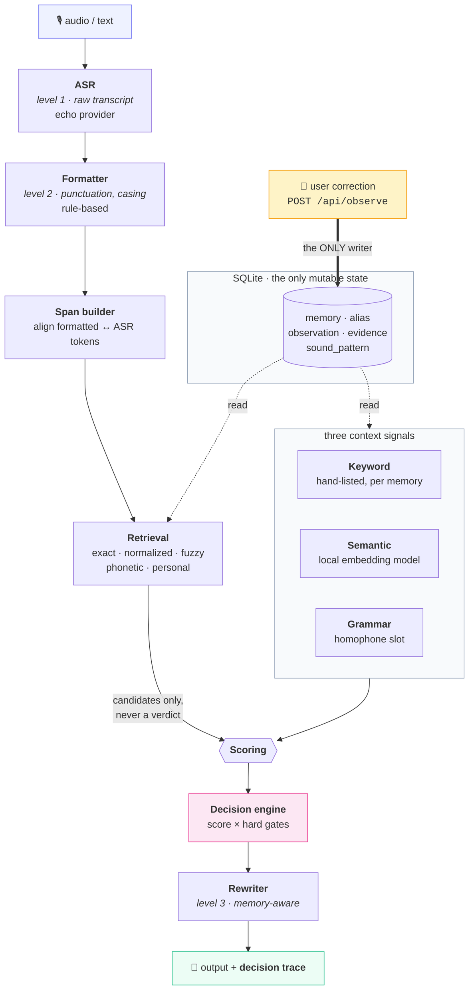
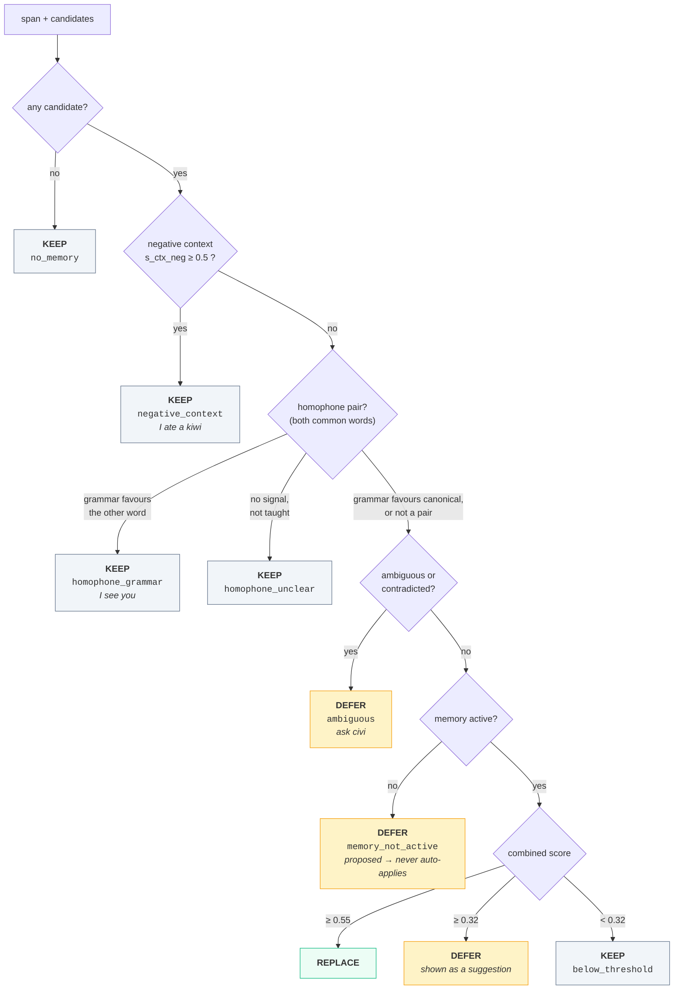
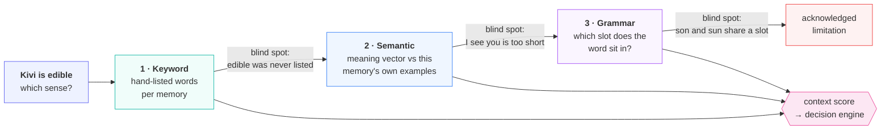
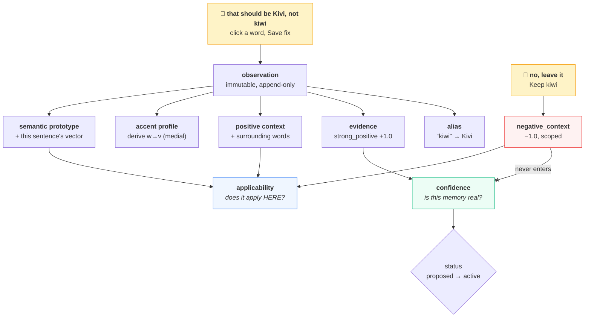

# Kivi · Personal Phonetic Memory

Word-level memory that moves a transcript from **formatted** to **memory-aware** —
so Kivi writes the words *this particular person* uses, the way they use them.

```
ASR          ask aditya to review the sarvam kiwi service
Formatted    Ask Aditya to review the Sarvam Kiwi service.
Memory-aware Ask Aaditya to review the Sarvam Kivi service.
```

`Aditya → Aaditya` is a preferred spelling ASR can't know. `Kiwi → Kivi` is a product
name a model has no reason to prefer. Kivi learns both from ordinary corrections and
applies them next time — while leaving the fruit alone in *"I ate a kiwi today."*

Kivi's dictionary is **not** a replacement list. A phonetic/fuzzy match only **nominates a
candidate**; a deterministic, explainable engine then decides **REPLACE / KEEP / DEFER**,
and records the scores + evidence + a plain-English reason for every word.

**Run it:** [`RUN.md`](RUN.md) — `python manage.py {reset|serve|eval|process}`.
Committed evaluation: [`evaluation/results/report.md`](evaluation/results/report.md).

---

## Pipeline



Processing is **read-only** w.r.t. memory — running the pipeline a thousand times changes
nothing. Only a user observation writes. No LLM anywhere: `model_calls` and
`est_cost_usd` are `0` by design.

### The decision engine

Gates are checked **in order**; the first one that fires wins. This ordering is the whole
safety story — it is why a learned accent rule can never override a deliberate KEEP.



`combined = s_surf × confidence × context_gate × personal_boost` — multiplicative, so any
weak factor vetoes. The personal boost is applied **after** the gates and is capped, so it
can lift a near-tie but never force an intervention.

## Core ideas

| Idea | Where |
|---|---|
| A phonetic hit is a **nomination**, not a verdict | `memory/retrieval.py` |
| **Confidence** (is this real?) and **applicability** (does it apply here?) are separate axes | `memory/confidence.py` + `context.py` |
| **Context-scoped negative evidence** — rejecting *"I ate a kiwi"* never weakens the `Kivi` memory | `memory/learning.py` |
| **DEFER** is a real outcome — ambiguity, weak memory, contradiction, unclear homophone | `decision.py` |
| **Deliberate non-intervention** is first-class, tested, and measured | eval `non_intervention_accuracy`, `over_intervention_count` |
| Thresholds are named constants treated as hypotheses validated by eval | `config.json` |

---

## Contextual understanding

Three independent signals feed the same decision engine. None of them can replace a word
on their own — they only move the score. They are deliberately layered cheapest-first,
and each covers the previous one's blind spot.



### 1. Keyword context (rule-based)

Each memory accumulates the words it was confirmed and rejected on. Cheap, exact, and
the reason `open the kiwi service` works on day one.

### 2. Semantic layer — a local embedding model

A keyword list can never enumerate every word that signals a context. Each utterance is
turned into a meaning vector and compared to **that memory's own** confirmed and rejected
examples. Nothing is hardcoded per word.

```
Memory: Kivi (product).  Rejected examples: "I ate a kiwi", "the kiwi juice was tasty".

Kivi is edible.                    →  unchanged              KEEP   (sem −0.63)
the kiwi looked crimson and juicy  →  unchanged              KEEP   (sem −0.30)
Kivi is green and oval.            →  unchanged              KEEP   (sem −0.14)
Kivi is on the kitchen counter.    →  unchanged              DEFER  (sem −0.04)
roll back the kiwi deployment      →  ... Kivi deployment    REPLACE(sem +0.33)
deploy kivi now                    →  Deploy Kivi now.       REPLACE(sem +0.55)
```

**"edible", "crimson", "oval", "kitchen counter" appear in no list anywhere.** The model
places them near the memory's rejected examples, so the fruit sense is protected without
anyone enumerating fruit words.

Vectoriser: **`model2vec`** static embedding model, vendored at
`backend/kivi/models/potion-base-8M` (~31 MB). Offline, deterministic, pure numpy, no
torch, no network, ~0.1 ms/encode. If it is unavailable the system falls back to a shipped
semantic-field lexicon (`data/semantic_fields.json`) with zero dependencies.

### 3. Grammar layer — homophones

Surface match cannot tell `see` from `sea`; they share the alias. The **grammatical slot**
can:

```
Memory: sea ← see

I see you.                →  unchanged             KEEP    (pronoun before → verb slot)
can you see the screen    →  unchanged             KEEP    (verb slot)
let me see the report     →  unchanged             KEEP    (verb slot)
the see is calm today     →  The sea is calm today. REPLACE (determiner + "is" → noun slot)
waves crash on the see    →  ... on the sea.        REPLACE (preposition + determiner)
I want to see the sea     →  unchanged             KEEP    (verb "see" and noun "sea" in one line)
```

A pair is treated as a homophone when canonical **and** matched alias are both ordinary
English words (`data/common_words.json`, 146 POS entries). Then surface match and
correction history can no longer force a REPLACE — only grammar or real context can.

**Function words are protected.** Teaching `no → know` must not rewrite every "no":

```
Memory: know ← no

I no you.                →  I know you.               REPLACE (verb slot)
do you no where it is    →  Do you know where it is?  REPLACE (verb slot)
there is no problem      →  unchanged                 KEEP    (determiner slot)
no one came              →  unchanged                 KEEP
he has no idea           →  unchanged                 KEEP
```

**Same part of speech → grammar abstains.** `son` and `sun` are both nouns, so
"The son is a doctor" and "The sun is a star" are structurally identical. Grammar returns
*unclear* and hands off to the semantic layer:

```
Memory: Sun ← son   (taught once, from "The son glows.")

son glows.                          →  Sun glows.               REPLACE (sem +0.82)
son is the center of solar system.  →  Sun is the center ...    REPLACE (sem +0.20)
My son is studying law.             →  unchanged                KEEP    (sem −0.06)
My son plays every day.             →  unchanged                KEEP    (sem +0.08, below bar)
son studies.                        →  unchanged                KEEP    (sem +0.08, below bar)
```

A taught correction on a same-POS pair is applied only when the meaning **clearly** agrees
(`semantic_context.pos_clear`). Below that it is surfaced, never auto-applied.

## How a memory learns

One correction fans out into five effects. Confidence and applicability are updated on
**separate axes** — this is why rejecting *"I ate a kiwi"* teaches Kivi where **not** to
apply without ever weakening the `Kivi` memory itself.



Verified by eval `memory_stability` (**11/11**) and by the idempotency check: processing
the same utterance twice produces identical output and grows nothing.

## Personal (accent-adaptive) phonetics

A generic phonetic key encodes how English sounds *in general* — identical for everyone.
But one speaker + mic + ASR model mangles the same sounds the same way, repeatedly.

Each correction is aligned (`misheard ↔ chosen`) into small position-tagged substitution
rules — `w→v (medial)`, `l→r (onset)` — that accumulate in an inspectable `sound_pattern`
table (the user's **accent profile**) and feed retrieval two ways:

1. **Candidate creation** — apply the profile to an unmatched span; if the result lands on
   a known memory, nominate it (`match_method = personal`). Catches confusions that share
   no generic key and fall below the fuzzy floor.
2. **Disambiguation prior** — a memory this user's ASR has demonstrably mangled before
   gets a small, capped boost that can break a near-tie (`ask civi` → `Kivi`, not `Sivi`).

The boost is applied **after** the hard gates, so it can never override a KEEP or
auto-apply a not-yet-active memory. Module: `memory/phonetic_profile.py`.

## Flagship behaviour

| Input | Memory-aware output | Why |
|---|---|---|
| `Open the kiwi service.` | `Open the **Kivi** service.` | active memory + software context |
| `I ate a kiwi today.` | *unchanged* | memory matches, but food is a do-not-apply context |
| `Kivi is edible.` | *unchanged* | "edible" is in no list — the embedding model places it in the rejected region |
| `ask civi` | *DEFER* | fits both `Kivi` and colleague `Sivi` — too close to choose |
| `we should ship devy this sprint` | *DEFER* | `Devi` is only `proposed` — never auto-replaces |
| `deploy the Zephyr module` | *KEEP* | no memory; none is hallucinated |
| `tell lehan about the sync` *(after `lehaan`/`lehin` → `Rehan`)* | `Tell **Rehan** about the sync.` | learned accent rule `l→r (onset)` |
| `I see you` *(with a `sea`←`see` memory)* | *unchanged* | verb slot — grammar refuses the replacement |

## Stack

Python 3.11+. Core decision logic is **stdlib-only**; the packages are FastAPI + uvicorn
for the HTTP layer and `model2vec` + `numpy` for the semantic layer (which degrades to a
zero-dependency lexicon if absent). **SQLite** single file (`database/kivi.db`), plain
numbered SQL migrations. Vanilla-JS SPA.

## Layout

```
manage.py                    migrate / seed / reset / serve / eval / process
config.json                  all thresholds & weights (validated by eval)
backend/kivi/                normalization, phonetics, spans, retrieval, context,
                             semantic, grammar, decision, rewrite, explain, pipeline
  semantic.py                embedding-based context (model2vec, lexicon fallback)
  grammar.py                 homophone slot classifier (rule-based)
  memory/phonetic_profile.py accent-adaptive phonetics
  data/semantic_fields.json  fallback semantic-field lexicon
  data/common_words.json     common words + homophone POS map
  models/potion-base-8M/     vendored static embedding model (~31 MB)
backend/api/main.py          FastAPI endpoints
database/migrations/         0001_init.sql, 0002_personal_phonetics.sql
database/seed/seed.json      5 seed memories + 1 seed accent rule
evaluation/dataset/          cases.jsonl (40)
evaluation/run.py            harness
evaluation/results/          COMMITTED: summary.json, report.md, cases/*, failures/*
frontend/                    index.html + styles.css
tests/test_basic.py          32-test unittest suite
```

## Results (`evaluation/results/summary.json`)

- **40 / 40** cases pass · action accuracy 100% · exact output match 100%
- intervention precision / recall / F1 = **100%**
- **non-intervention accuracy 100%**, over-intervention **0**
- memory-stability **11/11** · idempotency **1/1** · personal-phonetics **5/5**
- latency p50 ≈ 2.7 ms, p95 ≈ 6.4 ms · model calls **0** · cost **$0**

Categories cover useful interventions, deliberate non-interventions, ambiguity, weak
memories, accent adaptation, semantic context, homophones, and memory stability. The
dataset is small and co-designed with the system — its value is the **methodology and
harness**, which records per-case scores and writes `failures/<id>.json` for any miss.

## Limitations

- **Same-part-of-speech homophones are the hard case.** `son`/`sun`, `flour`/`flower`:
  grammar cannot help and the 8M static model is weak on short utterances. `the son rises
  in the east` scores +0.055 and is *not* replaced, while `son glows` (+0.82) is. A larger
  embedding model or an LLM for the unclear band would close this; both were out of scope
  for a $0, offline, deterministic core.
- **Grammar coverage is a list.** 146 homophone POS entries. Pairs outside it fall back to
  the semantic layer only. Adding a pair is two lines of JSON.
- **Food-context guard is sentence-level** — an eating clause anywhere suppresses a later
  legitimate product mention.
- **No morphology** — *"kiwis"* matches *"Kivi"* and the plural is dropped.
- English-centric; single-user; the ASR provider is an echo stub by default.

## AI use

**Build time:** written with Claude Code as a pair-programmer; every design decision —
the evidence model, the confidence/applicability split, gate ordering, the homophone
policy, the limitations above — was directed and reviewed by me.

**Run time:** no AI service call. The semantic layer runs a small *embedding* model
locally from vendored weights (deterministic, offline, $0); everything else is phonetics,
edit distance and rules. No API key, no private corpus.
